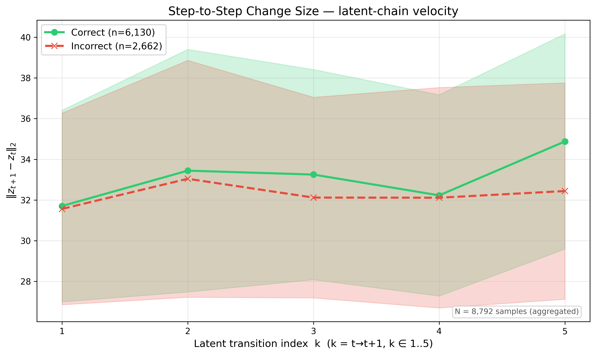
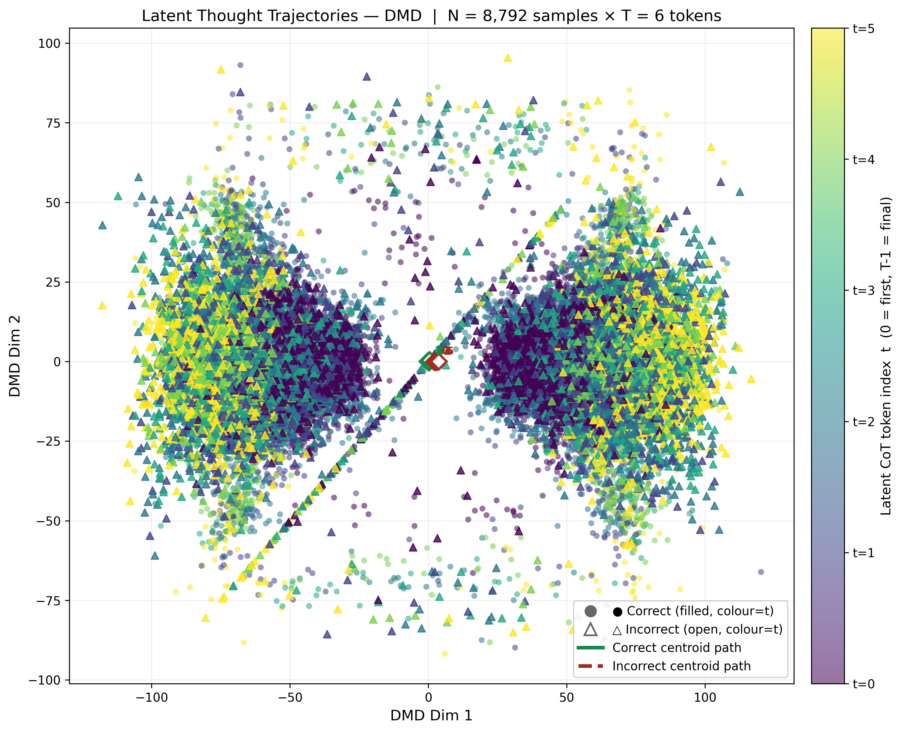
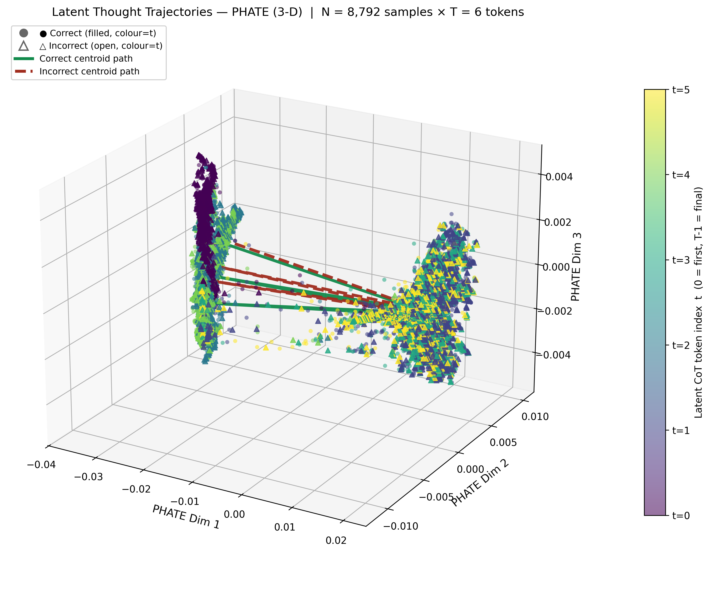
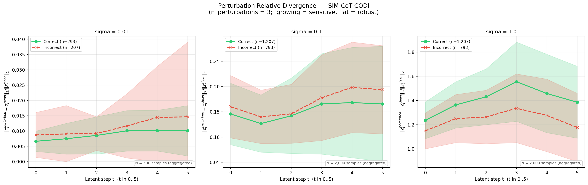

# Interpreting Latent CoT Reasoning as Dynamical Systems

<p align="center">
  <a href="https://sabariiyyappan.github.io/Latent-CoT/">
    
  </a>
</p>

> **Abstract.** Recent latent reasoning methods, such as CODI and
> COCONUT, face a fundamental interpretability problem: they maintain
> multiple superimposed candidate traces in the hidden space at each
> step, unlike explicit-CoT, which follows a single transparent
> reasoning trace. Existing mechanistic methods show compression,
> shortcuts, and superposition without explaining how reasoning evolves
> across latent steps. To address this gap, we model latent token
> sequences as trajectories in representation space and apply dynamical
> systems analysis to characterize the evolution of reasoning. Using
> quantitative measures, such as step-to-step change, direction
> consistency, and Lyapunov sensitivity, alongside qualitative
> projections, such as UMAP and DMD/PHATE, we show that latent CoT
> exhibits structured, non-random dynamics with two distinct stability
> classes. CODI behaves as a stable attractor, while COCONUT behaves as
> an unstable expanding system, and Sim-CoT supervision tightens both
> behaviors without changing the underlying dynamics. This framework
> advances the interpretability of latent CoT reasoning dynamics and
> provides actionable insights for improving latent reasoning
> performance.

This repository is the code for the paper above. The codebase covers a
2 × 2 grid — two latent CoT methods under two training paradigms — all
on GSM8K (8,792 samples, train + test):

|         | **CODI** | **COCONUT** |
|---|---|---|
| **Vanilla CoT** | `ModalityDance/latent-tts-codi`    | `ModalityDance/latent-tts-coconut` |
| **Sim-CoT**     | `internlm/SIM_COT-GPT2-CODI`       | `internlm/SIM_COT-GPT2-Coconut`    |

All four cells are GPT-2-small backbones (124 M parameters) and run
through a single entry point, `runner.py`.

> The camera-ready paper will be posted to arXiv; the link will be
> added here once it is up.

---

## Repository structure

Two paradigm folders, one shared analysis library:

```
Latent-COT/
├── runner.py                  ← single entry point (inference / analysis / perturbation)
├── requirements.txt
│
├── vanilla/                   ← Vanilla CoT paradigm
│   ├── README.md
│   ├── checkpoints.md         ← expected checkpoint layout + download commands
│   └── configs/
│       ├── inference_codi_gsm8k.yaml
│       └── inference_coconut_gsm8k.yaml
│
├── simcot/                    ← Sim-CoT paradigm
│   ├── README.md
│   ├── checkpoints.md
│   ├── bootstrap_codi.py      ← one-time HF-release → checkpoint translation
│   ├── bootstrap_coconut.py     (runner.py invokes these automatically)
│   └── configs/
│       ├── inference_codi_gsm8k.yaml
│       └── inference_coconut_gsm8k.yaml
│
├── analysis/                  ← shared analysis library (paradigm-agnostic)
│   ├── wrappers.py            ← ModelWrapper + MODEL_REGISTRY
│   ├── data_prep.py           ← GSM8K loading, 7-concept stratification, inference loop
│   ├── dim_reduct.py          ← PCA / t-SNE / UMAP / DMD / PHATE
│   ├── stability.py           ← trajectory features + stability metrics + perturbation
│   └── plotting.py            ← every figure renderer
│
├── src/                       ← LatentTTS-derived model classes (see src/UPSTREAM.md)
│   ├── generation_mixin.py    ← LatentGenerationMixin (latent-step decoding loop)
│   └── models/{codi,coconut}.py
│
├── pipeline_scripts/          ← one-command bash wrappers
│   ├── main_pipeline.sh       ← H5 latent prep + main analysis
│   └── perturb_pipeline.sh    ← do/reuse H5 latent prep + perturbation analysis
│
├── scripts/                   ← analysis workflows
│   ├── perturbation/          ← paper-grid perturbation runs + consolidated 3-σ figure
│   ├── trajectory/            ← 3-D DMD / PHATE trajectory plots
│   └── replay/                ← re-run analysis or re-render plots from cached HDF5
│
├── tests/                     ← pytest suite + claim verifiers
├── notebooks/                 ← Colab notebook for GPU hand-off (perturbation grid)
└── results/                   ← PNG plots tracked; HDF5 caches gitignored
```

Per-folder details: [`vanilla/README.md`](./vanilla/README.md),
[`simcot/README.md`](./simcot/README.md),
[`scripts/README.md`](./scripts/README.md).

---

## Pipeline

`runner.py` exposes three flows:

```
MAIN PIPELINE (default)
┌────────────────────┐   ┌───────────────────────┐   ┌───────────────────────────┐
│ checkpoint ready?  │ → │ INFERENCE             │ → │ ANALYSIS + PLOTS          │
│ (simcot: bootstrap │   │ model → GSM8K → H5    │   │ PCA/t-SNE/UMAP/DMD/PHATE  │
│  runs automatically)│  │ latent trajectories   │   │ step-change / direction / │
└────────────────────┘   └───────────────────────┘   │ arc length / Lyapunov /   │
                                                     │ fixed-point + all figures │
                                                     └───────────────────────────┘
If --run_dir points at a run whose trajectories H5 already exists,
inference is skipped and the analysis runs in place (no GPU needed):

    python runner.py --paradigm vanilla --method codi \
        --run_dir results/vanilla_codi/<timestamp>

PERTURBATION (separate flow — consumes the saved H5 trajectories)
┌───────────────────────┐   ┌────────────────────────┐   ┌──────────────────────┐
│ cached H5 (clean      │ → │ re-run model with      │ → │ divergence merged    │
│ baseline trajectories)│   │ Gaussian noise σ on    │   │ into stability.h5 +  │
│                       │   │ input embeddings       │   │ divergence figure    │
└───────────────────────┘   └────────────────────────┘   └──────────────────────┘

    python runner.py --paradigm simcot --method codi --perturbation \
        --run_dir results/simcot_codi/<timestamp> --noise_std 0.01
```

For the full paper grid (σ ∈ {0.01, 0.1, 1.0} × both methods, N = 2000
stratified) use `scripts/perturbation/add_perturbation.py`, which writes
σ-suffixed keys and filenames so runs coexist, then consolidate with
`scripts/perturbation/plot_perturbation_relative_grid.py`. The
[Colab notebook](./notebooks/perturbation_full_gsm8k_colab.ipynb) wraps
the same grid for hosted A100 GPUs.

---

## Quick start

### Requirements

```bash
python -m venv .venv && source .venv/bin/activate    # PowerShell: .venv\Scripts\Activate.ps1
pip install -r requirements.txt
```

Python ≥ 3.10. A CUDA GPU is recommended for inference (the paper runs
used NVIDIA A100s); analysis and plotting are CPU-only.

### Checkpoints

```bash
# Vanilla — plain HuggingFace snapshots
huggingface-cli download ModalityDance/latent-tts-codi    --local-dir checkpoints/codi
huggingface-cli download ModalityDance/latent-tts-coconut --local-dir checkpoints/coconut

# Sim-CoT — nothing to do: runner.py bootstraps the upstream release
# automatically on first use (simcot/bootstrap_{codi,coconut}.py)
```

### 1. Prepare the H5 latent representations (+ main analysis)

One command per cell of the paper's 2 × 2 grid. Each writes
`results/<paradigm>_<method>/<timestamp>/`: it runs inference, saves the
latent-state HDF5 (`latent_states/all_states.h5`), then runs the main
analysis (every reduction, every trajectory feature, every figure).

```bash
python runner.py --paradigm vanilla --method codi
python runner.py --paradigm vanilla --method coconut
python runner.py --paradigm simcot  --method codi
python runner.py --paradigm simcot  --method coconut
```

To re-run only the main analysis on an existing H5 (no GPU), point
`--run_dir` at the run — inference is skipped:

```bash
python runner.py --paradigm vanilla --method codi \
    --run_dir results/vanilla_codi/<timestamp>
```

### 2. Perturbation analysis (reuses the H5 from step 1)

A separate flow that takes the saved H5 as the clean baseline, re-runs
the model with Gaussian noise on the input embeddings, merges the
divergence metrics into the run's `stability.h5`, and writes the
divergence figure:

```bash
python runner.py --paradigm simcot --method codi --perturbation \
    --run_dir results/simcot_codi/<timestamp> --noise_std 0.01
```

### One-command wrappers

`pipeline_scripts/` bundles everything — virtual env, requirements, and
the run — so a whole paradigm × method cell goes from a single call.
Each script defaults to the vanilla + codi cell; pick another with the
`PARADIGM` / `METHOD` variables:

```bash
# H5 latent prep + main analysis (defaults to vanilla + codi)
bash pipeline_scripts/main_pipeline.sh
PARADIGM=simcot METHOD=coconut bash pipeline_scripts/main_pipeline.sh

# quick smoke first (few samples, CPU) before a full run
N_SAMPLES=5 DEVICE=cpu bash pipeline_scripts/main_pipeline.sh

# do/reuse the H5 latent prep, then perturbation analysis
PARADIGM=simcot METHOD=codi NOISE_STD=0.1 bash pipeline_scripts/perturb_pipeline.sh
```

### Smoke test

Quick end-to-end check (5 samples; `--device cpu` works without a GPU):

```bash
python runner.py --paradigm vanilla --method codi --n_samples 5 --device cpu
```

---

## Example outputs

One representative figure per analysis family (from the full N = 8,792
runs; regenerate with step 1 above).

### Step-to-step change — main paper §5.1

Displacement `‖z_{t+1} − z_t‖₂` between consecutive latent states.
Decreasing profile = decelerating trajectory.



### DMD trajectory — main paper §5.2

Trajectories projected onto dominant DMD modes. Tight clusters indicate
contraction toward a bounded region.



### 3-D trajectory view — qualitative analysis §4.3.1

Three-component PHATE embedding of the same latent trajectories,
colour-graded by latent step (the paper visualises reduced
representations in R² and R³; all reductions project to k = 2 and
k = 3 per appendix A.1.1).



### Perturbation relative divergence — §5.1, hyperparameters A.1.2

Relative divergence `‖z_t^pert − z_t^clean‖₂ / ‖z_t^clean‖₂` under
Gaussian noise on input embeddings, tested at σ ∈ {0.01, 0.1, 1.0}
(§5.1); correct (green) vs incorrect (red).



---

## Paper figure → producer map

| Paper figure | Section | Producer |
|---|---|---|
| Fig 1 — Pipeline overview | §1 | schematic (not pipeline-generated) |
| Fig 2 — Step-to-step change | §5.1 | main pipeline (`runner.py`, one run per cell) |
| Fig 3 — Lyapunov sensitivity | §5.1 | main pipeline |
| Fig 4 — Direction consistency | §5.1 | main pipeline |
| Fig 5 — DMD trajectory | §5.2 | main pipeline |
| Fig 6 — PHATE trajectory | §5.2 | main pipeline |
| Fig 7 — UMAP trajectory | §5.2 | main pipeline |
| Fig 8 — PCA projections | A.2.1 | main pipeline |
| Fig 9 — t-SNE projections | A.2.2 | main pipeline |

Analyses discussed in the paper without a numbered figure are also
produced by the pipeline: arc length (Eq. 3, §5.1) and fixed-point
distances (§4.3.2) come out of every main-pipeline run; perturbation
stability (§5.1, hyperparameters in A.1.2) via the perturbation flow;
3-D (k = 3) trajectory views (§4.3.1, A.1.1) via
`scripts/trajectory/add_3d_plots.py <run_dir>`.

---

## Testing

```bash
pytest tests/                                                      # ~30 s
python runner.py --paradigm vanilla --method codi --n_samples 5 --device cpu
```

The pytest suite exercises the analysis library on deterministic
synthetic inputs plus (when the checkpoint is present) real-model
integration tests. The runner command is a full end-to-end smoke:
checkpoint → inference → H5 → analysis → figures.

---

## Reproducibility

- Fixed random seed 42 everywhere (sampling, inference, reductions)
- Greedy decoding, `max_new_tokens = 512`, T = 6 latent steps per input
- Stratified sampling across the 7 GSM8K concept buckets
- Pinned dependencies in `requirements.txt`
- `analysis/wrappers.py:MODEL_REGISTRY` is the single source of truth
  for per-method special tokens, prompt templates, and loading

Paper runs were executed on NVIDIA A100 GPUs (Google Colab and the
university Turing cluster). A full cell (inference + analysis over all
8,792 samples) takes on the order of 30 minutes; the
[notebooks/](./notebooks/) folder carries the Colab notebook used for
the hosted perturbation-grid runs. CPU-only smoke tests are supported
via `--device cpu`.

---

## License and attribution

Model classes under `src/` derive from the LatentTTS upstream
repository ([github.com/YRYangang/LatentTTS](https://github.com/YRYangang/LatentTTS),
MIT licensed) — see [`src/UPSTREAM.md`](./src/UPSTREAM.md). Sim-CoT
checkpoints are released by Wei et al. (arXiv 2509.20317); vanilla
checkpoints derive from the CODI (Shen et al., 2025) and COCONUT
(Hao et al., 2024) papers. Analysis code in `analysis/` is original to
this project.

---

## Citation

If you use this code, please cite the paper:

```bibtex
@inproceedings{latentcot-dynamical-systems-2026,
  title     = {Interpreting Latent CoT Reasoning as Dynamical Systems},
  booktitle = {ICML 2026 Workshop on Foundations of Deep Generative Models:
               Understanding Memorization, Generalization, and Reasoning},
  year      = {2026},
  url       = {https://github.com/SabariIyyappan/Latent-CoT-Reasoning-as-Dynamical-Systems}
}
```

> The author list and arXiv identifier will be added to this entry once
> the camera-ready is posted (the workshop submission is anonymous).

---

## Contributing

Issues and pull requests are welcome. If you find this work useful,
please consider starring the repository — it helps others discover it.
